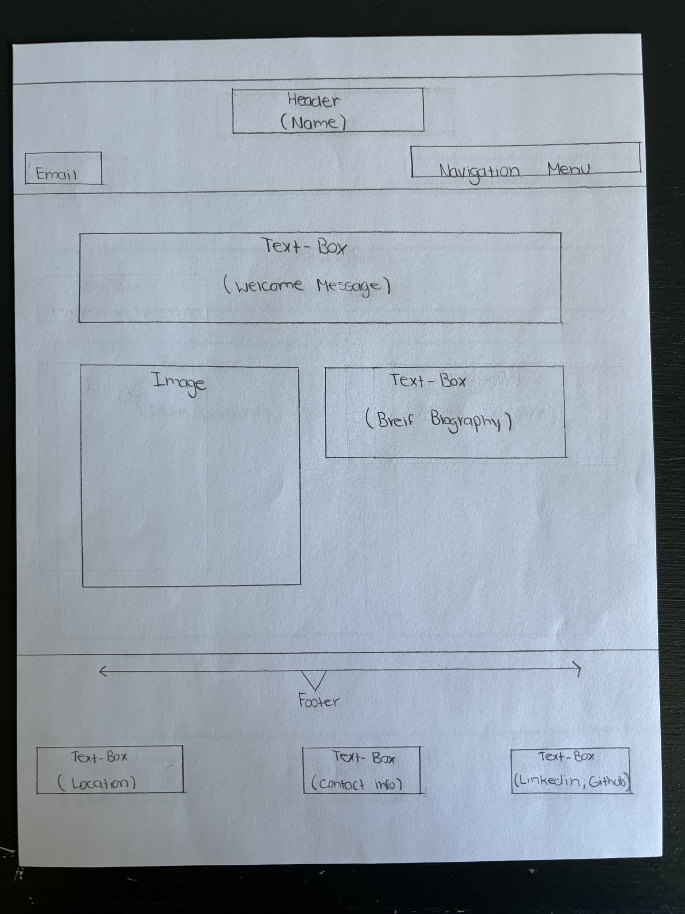
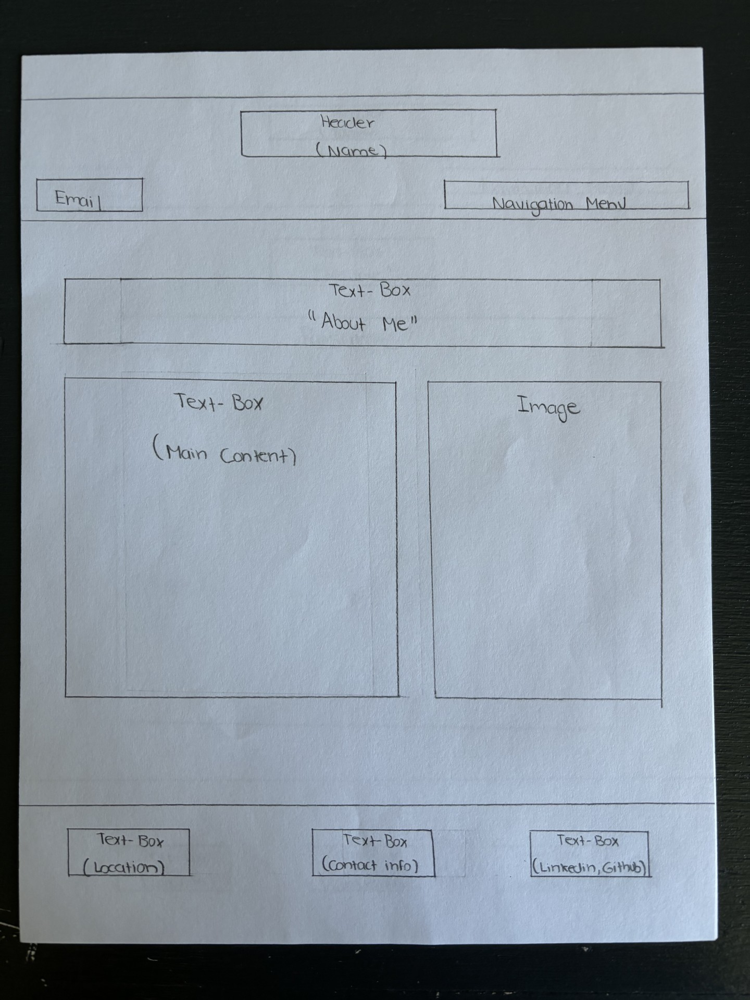
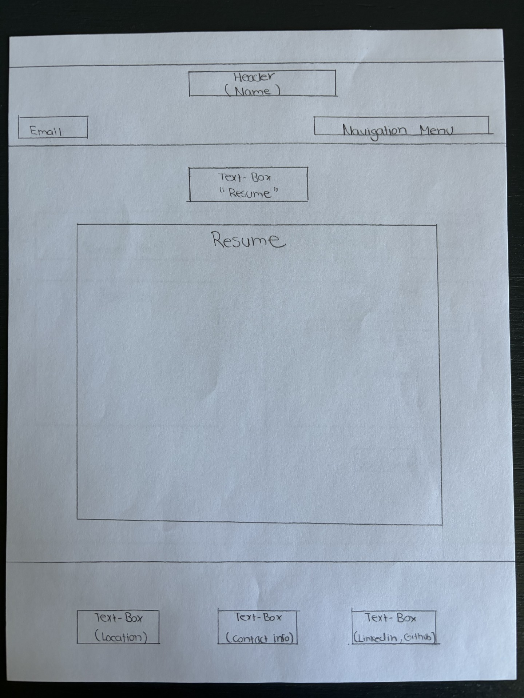
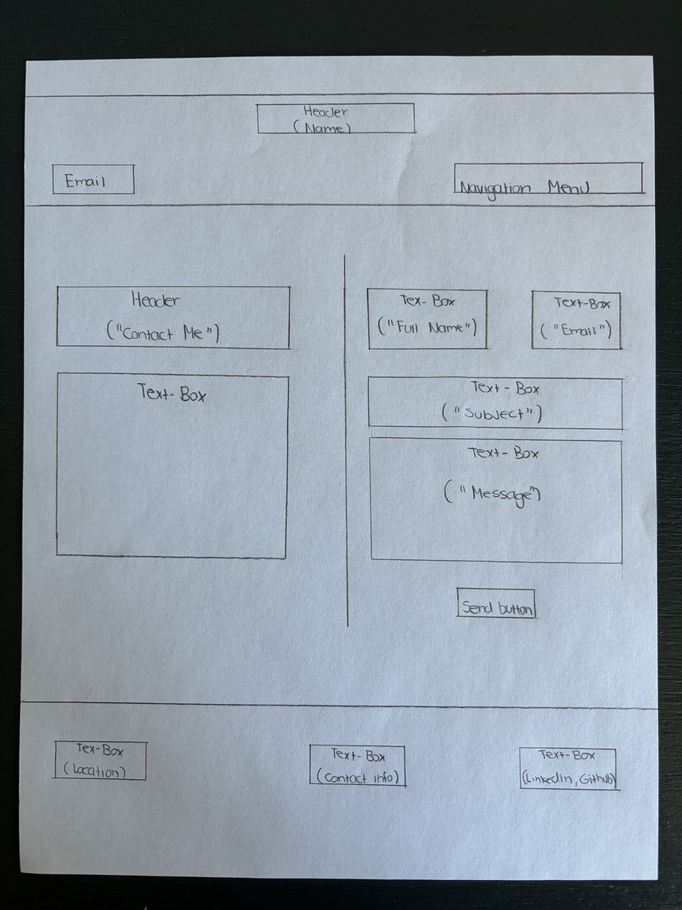

# Madison Brewer's INF6420 Project

A portfolio website showcasing my work

## Wireframes

I created the wireframes to plan the layout and design of my portfolio website.

Header - Will include my name, email, and navigation menu

Navigation Menu - Will include links to other pages such as a contact, resume, and an about me page

Main Content - Will discuss my skills and projects I have completed and inlude pictures

Footer - Will include my location, email, and links to Linkedin and Github 

Header - Will include my name, email, and navigation menu

Navigation Menu - Will include links to other pages such a contact, resume, and an about me page

Main Content - Will discuss my education background, skills, and future goals. Will also display an image

Footer - Will include my location, email, and links to Linkedin and Github

Header - Will include my name, email, and navigation menu

Navigation Menu - Will include links to other pages such a contact, resume, and an about me page

Main Content - Will display my resume

Footer - Will include my location, email, and links to Linkedin and Github

Header - Will include my name, email, and navigation menu

Navigation Menu - Will include links to other pages such a contact, resume, and an about me page

Main Content - Will include an encouraging message to contact me and a link to send me an email

Footer - Will include my location, email, and links to Linkedin and Github

